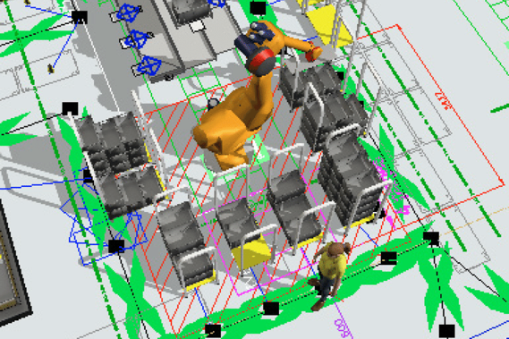
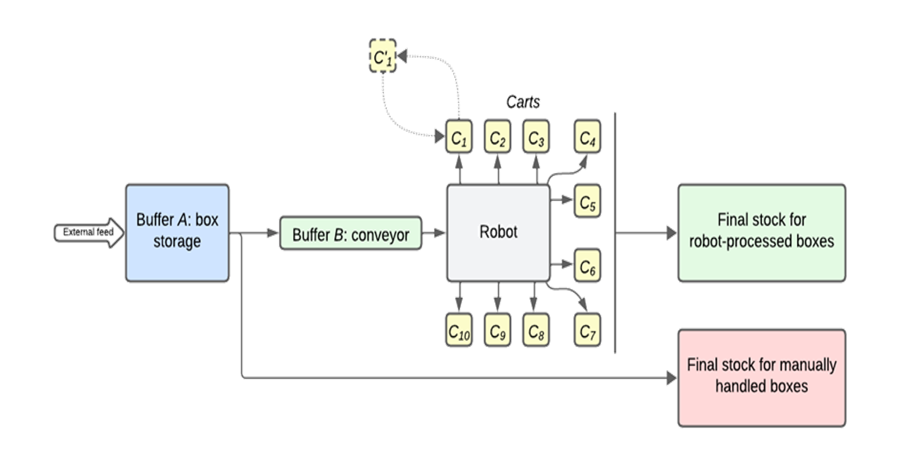

# Benchmark Problem. "The Flexibac problem"
## Industrial context
The problem is extracted from an industrial collaboration between the group La Poste (French postal services) and Nantes University. The purpose of this collaboration was to define suitable control strategies for an existing mail sorting system in which a 6-axis robot was going to be introduced. The overall project was called Flexibac, and a schematic representation of the expected result can be seen in the following figure. Pictures of the actual implementation of the robot cannot be shown due to confidentiality issues. 

This project addresses critical operational challenges in mail distribution centers. In the current system, mail is stored in boxes weighing approximately 20kg each, with 250 different possible destinations. Human operators manually move these boxes from outputs to carts that are later transported to trucks. The system handles between 10,000 to 35,000 boxes daily, creating significant physical strain on workers and risks of musculoskeletal disorders. To address this, a robotic solution was introduced where a robot loads carts with mail containers, ensuring each cart contains boxes sharing the same destination (homogeneous carts). The system faces several operational constraints:

 - While there are 250 possible container destinations, only 10 carts can be positioned around the robot at any time.
 - Each robot operation takes approximately 5 seconds to handle a container.
 - Cart changes, whether full or not, require about 1 minute to complete.
 - Each cart has a fixed capacity that cannot be exceeded.

Thus, the key decisions in this system revolve around two main questions:

 - Cart allocation: Which destination carts should be placed around the robot throughout the production period to optimize the overall system performance?
 - Box handling distribution: Which boxes should be handled by the robot versus manually by operators, considering the system's constraints and efficiency goals?

These decisions directly impact both the system's throughput and the reduction of physical strain on human operators, making them crucial for the overall success of the automation project.

## Introduction

This benchmark study bridges both qualitative and quantitative research approaches, with a primary focus on operational performance metrics while carefully considering real-world practical constraints. Positioned at the intersection of intelligent manufacturing control, operational research, industrial automation, industrial engineering, and logistics optimization, the study aims to enhance the design and control strategies of robotic mail sorting systems while simultaneously addressing the critical need to reduce human physical strain. The contribution is twofold: theoretical, through advancing knowledge in robotic control strategies, and empirical, by delivering practical solutions ready for industrial implementation. The research seeks to validate scheduling algorithms, planification and decision-making processes specifically designed for robot-assisted sorting systems. The expected outcomes include optimal or near-optimal solutions that will maximize robotic handling efficiency while minimizing both manual operations and cart changes, ultimately providing a comprehensive framework for improving automated mail sorting operations.

## Glossary

To ensure clear communication and shared understanding among all stakeholders, this section provides definitions of key terms and parameters used throughout the problem description. Each term is accompanied by its common synonyms to maintain consistency across different implementations. Contributors should reuse existing terms and definitions from existing standards and not invent new ones unless they have a very specific concept that requires the introduction of a new key term and definition. Any new key term and definition must be motivated and explained in the discussion of the proposed solution.

|    **Key terms**   |          **Synonyms**           |                                    **Definition**                                          | 
| :----------------: | :-----------------------------: | :----------------------------------------------------------------------------------------: | 
|  Buffer A          | Input buffer                    |  Main storage area for incoming boxes with limited capacity Amax                           | 
|  Buffer B          | convoyor  buffer                |  Robot input conveyor with limited capacity Bmax                                           | 
|  Available carts   | Cart positions                  |  Maximum number of carts that can be positioned around the robot simultaneously (Nc)       |
|  Cart              | Container                       |  Storage unit placed around the robot with fixed capacity Qmax                             |
|  Cycle time        | Handling time                   |  Time needed for the robot to pick and place one box (Tp)                                  |
|  Cart change time  | Changeover time                 |  Fixed duration needed to replace a cart (Tc)                                              |
|  Competion date    | Time horizon, Planning horizon  |  Total duration of the scenario to be considered for planning and optimization (EndDate)   |

## Considered topology 

The physical layout and interaction between system components play a crucial role in understanding the constraints and opportunities for optimization. While the actual industrial system encompasses a complex network of conveyors and workstations, we present here a simplified yet representative model that captures the essential elements and their relationships. Thus, to facilitate understanding and avoid misinterpretation, the complex industrial sorting system has been deliberately simplified into a schematic topology, as illustrated in the following figure, highlighting the key elements: input buffer A, the convoyor buffer B, the robotic cell, the cart positions as well as the final strocks for both robot-processed boxes and the manually handled boxes. 

## Goals

The Flexibac problem addresses multiple objectives that balance operational efficiency with practical constraints. The following goals have been established to guide the development and evaluation of competing solutions, with special attention to both automated and manual operations management:
- The solution shall enable to maximize the number of boxes handled by the robot in a 24-hour period
- The solution shall enable to minimize the number of cart changes required from operators
- The solution shall enable to respect all system constraints (buffer capacities, cycle times, cart capacities)
- The solution shall enable to handle online (real-time) and/or offline (pre-planned) scenarios

## Metrics

Metrics are quantitative and/or qualitative performance indicators that measure the degree to which the articulated goals have been achieved.

*Guidelines:*

1. One or more metrics may measure the achievement of a given goal.
2. Results must be quantitatively and not only qualitatively compared to the literature in a fair and transparent manner.
3. Authors should use existing metrics and not invent new ones, unless they measure additional aspects not covered by existing ones.
4. Any change to existing metrics must be motivated and explained in the repository discussion (e.g., navigate to 'Repositories > Benchmark-0_Template > Discussions', or click here). Once the suggested change is informally approved by the community, the author shall post on the benchmark's issues page (e.g., navigate to '*Repositories > Benchmark-0_Template > Issues*' or [click here](https://github.com/GIS-S-mart/Benchmark-0_Template/issues)) and briefly outline the new metric.

*Template:*

| **Name** | **Definition** | **Unit** |
| :------: | :------------: | :------: |
|          |                |          |

## Benchmark exercises

Benchmark exercises are test cases that serve to evaluate rival solutions.

*Guidelines:*

1. A benchmark exercise is a representative example problem of the actual problem for which the solutions are intended.
2. Authors should reuse existing benchmark exercises and not invent new ones, unless they have a very specific illustrative purpose not covered by existing ones.
3. The lack of showing particular benchmark exercises in a manuscript says more than those included in a manuscript.
4. Any change to existing benchmark exercises must be motivated and explained in the discussion of the repository (e.g. navigate to '*Repositories > Benchmark-0_Template > Discussions*' or [click here](https://github.com/GIS-S-mart/Benchmark-0_Template/discussions). Once the community informally approves the suggested change, the author shall post on the issues page of the benchmark (e.g. navigate to *Repositories > Benchmark-0_Template > Issues*, or [click here](https://github.com/GIS-S-mart/Benchmark-0_Template/issues)) and briefly outline the new benchmark exercises.
5. A benchmark exercise shall be stored on an open online repository (to be selected according to the type and size of the dataset, licensing, etc.) such as [Zenodo](https://zenodo.org/), [Recherche Data Gouv](https://entrepot.recherche.data.gouv.fr/dataverse/root), [Harvard Dataverse](https://dataverse.harvard.edu/), [4TUandand.and ResearchData](https://data.4tu.nl/info/en/), [B2SHARE](https://eudat.eu/catalogue/B2SHARE), and [B2DROP](https://eudat.eu/catalogue/B2DROP) with a preference for repositories such as [Zenodo,](https://zenodo.org/) which creates a persistent identifier (DOI) for the repository. This helps for [referencing and citing a  GitHub repository](https://docs.github.com/fr/repositories/archiving-a-github-repository/referencing-and-citing-content).
6. If the benchmark exercise is not stored in the benchmark GitHub repository, contributors should specify the hyperlink to the source.
7. An existing benchmark exercise may be modified according to the feedback of members of the benchmark community. It is important to specify the version of the benchmark exercise so that candidate solutions can be evaluated using the latest version.

*Template:*

| **Name** | **Author(s)** | **Version** | **DOI** | **URL** | **License** |
| :------: | :-----------: | :---------: | :-----: | :-----: | :---------: |
|          |               |             |         |         |             |

## Solutions

A solution is a candidate theory, process, method, practice, [...], or software that aims to solve a benchmark exercise.

*Guidelines:*

1. It is imperative for good scientific practice that all results are reproducible.
2. It is strongly recommended that the research material (e.g., software code—at least an executable file -, model, simulation, coding book, interviews, statistics, raw data, observation voice/video recordings, etc.) be published.
3. The quantitative and/or qualitative metrics serve as a level of evidence which can be of four types:
   1. **Measured**: the benefit is measured through a measurement protocol.
   2. **Observed**: the benefit is noticed by the researcher(s) but is not measured through a measurement protocol.
   3. **Perceived**: The benefit—claimed without evidence—is expected or perceived to be evident by the researcher(s), but the claim is not based on a measurement protocol.
   4. **Reference** to another source: the benefit is cited from another source.

*Template:*

| **Name** | **Author(s)** | **Version** | **DOI** | **URL** | **License** | Evidence |
| :------: | :-----------: | :---------: | :-----: | :-----: | :---------: | -------- |
|          |               |             |         |         |             |          |

## Measurement protocols

A measurement protocol is a logical and repeatable procedure for evaluating metrics when using a candidate solution to solve a benchmark exercise. It ensures the successful replication of results by others. The recipe highly depends on the preferred research approach (quantitative empirical studies, qualitative empirical studies, mixed-methods studies, analytical studies, experiments, quasi-experiments, ethnographic research, phenomenological research, grounded theory, hermeneutics, case study research, action research, etc.). A measurement protocol may be solution agnostic or part of a candidate solution.

*Guidelines:*

1. 
2. 

*Template:*

## Benchmarking

Benchmarking shall enable visitors to determine which solution is better to employ in a specific context.

*Guidelines:*

1. When presenting a new solution, results must be quantitatively and not only qualitatively compared to the literature.
2. The comparison of solutions must be done in a fair and transparent manner.
3. Results should also be critically judged for physical sanity to avoid the ones that make little sense.

*Template:*

## Meta-Analysis

A meta-analysis integrates the findings by analysing all of the benchmark results. Meta-analytic results are the most trustworthy source of evidence.

## References

*Guidelines:*

- Please use the Harvard format to list references supporting any data (keyword definition, goal, metric, benchmark exercise, solution, etc.) of the benchmark.
- Make sure to provide the DOI of the document.

*Template:*

- **Book, one author:** Bell, J. (2010) *Doing your research project*. 5th edn. Maidenhead: Open University Press.

- **One author, book, multiple editions:** Hawking, S.W. (1998) *A brief history of time: From the big bang to black holes*. 10th edn. New York: Bantam Doubleday Dell Publishing Group.

- **Chapter in an edited book:** Jewsiewicki, B. (2010). ‘Historical Memory and Representation of New Nations in Africa’, in Diawara, M., Lategan, B., and Rusen, J. (eds.) *Historical memory in Africa: Dealing with the past, reaching for the future in an intercultural context*. New York: Berghahn Books, pp. 53-66.

- **More than three authors, journal article:** Shakoor, J., et al. (2011) ‘A prospective longitudinal study of children’s theory of mind and adolescent involvement in bullying’, *Journal of Child Psychology and Psychiatry*, 53(3), pp. 254–261. doi: 10.1111/j.1469-7610.2011.02488.x.

- **Conference papers:** Drogen, E. (2014) ‘Changing how we think about war: The role of psychology’, *The British Psychological Society 2014 Annual Conference*. The ICC, Birmingham British Psychological Society, 07-09 May 2014.

- **Web page, by an individual:** Moon, M. (2019) *Ubisoft put an official video game design course inside a video game*. Available at https://www.engadget.com/2019/09/25/ubisoft-video-game-design-course/ (Accessed 19 November 2019).

- **Web page, by a company or organization:** RotoBaller (2019) *NFL player news*. Available at https://www.rotoballer.com/player-news?sport=nfl (Accessed 17 September 2019).
