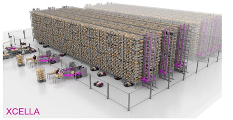
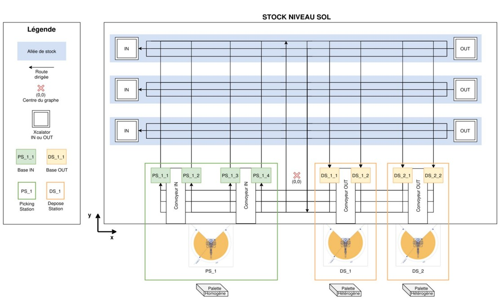
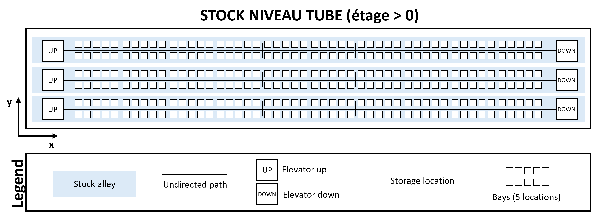
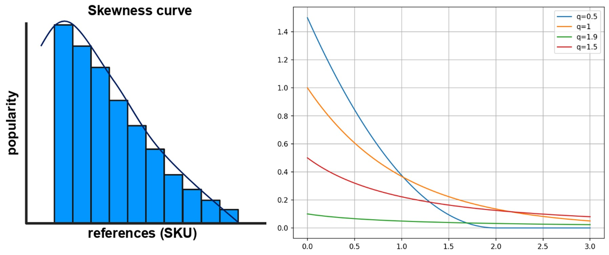

The **DYNALOG** project is part of the field of intralogistics and warehouse automation, where mobile robots meet companies’ needs for flexibility and performance. Specifically, the project focuses on evaluating FIVES XCELLA’s solution, in which order fulfillment is handled by a fleet of AGVs capable of navigating and accessing warehouse racks via a system of elevators to retrieve or deposit packages. This is a “case picking” solution, a method that involves picking a complete case of a product (bin or package) rather than a single unit, either to be stored in the warehouse or to assemble an outbound order (pallet).

This solution highlights the importance of inventory management, as well as task scheduling and the selection of AGV routes.

# Warehouse Description
The warehouses in the FIVES XCELLA solution organize product inventory into aisles with levels featuring elevators for ascending on one side and descending on the other. These levels are themselves organized into racks—units containing a certain number of storage locations for packages. Each bay is separated by shelf supports.

In addition to the storage area, there is a floor space dedicated to order picking and order preparation. Depalletizing robots place packages to be stored onto conveyors so that AGVs can retrieve them at collection points (IN Bases). Similarly, palletizing robots retrieve packages to be removed from inventory onto conveyors, which are fed by packages deposited by the AGVs at drop-off points (Bases OUT). We assume that the overall inbound and outbound throughput rates are equal, such that the average number of products in inventory remains constant.

The AGVs can move through the warehouse by traveling on the floor, using elevators (Xcalator) to access upper levels, and traveling on rails. All movements permitted by the AGVs are modeled as a directed graph. The nodes of the graph represent points of interest on the floor or within the warehouse.

A video is avalaible [here](https://www.youtube.com/watch?v=A7SbZuiYZvM) to show the system.

# Glossary

To ensure clear communication and shared understanding among all stakeholders, this section provides definitions of key terms and parameters used throughout the problem description. 

|      **Key terms**               |                                      **Definition**                                                          | 
| :------------------------------: | :----------------------------------------------------------------------------------------------------------: | 
|  Stock                           | A system of racks organized into aisles, levels, and bays (each aisle has N bays) for storing bins           | 
|  Tubes                           | Horizontal levels of the storage racks, which serve as the AGV traffic lanes on each floor                   | 
|  Bays                           | Furniture organizing the aisles: grouping storage locations. Each bay has 5 storage locations per level (nodes) accessible from the central tube (on the corresponding level)       |
|  Location                        | A storage location capable of holding one bin or package, accessible from a position within a tube (node), to the right or left across two levels of depth                             |
|  Container / package / Bin       | Individual containers stored in locations, each dedicated to a single item number                            |
|  Product reference (SKU)         | A unique item reference used to identify the contents of a bin. A bin can contain only one reference, but multiple stock locations may have the same reference (redundancy). Example: reference “597631” for “Evian water packs.”                                                        |
|  Upward Elevator: Xcalator IN    |  An elevator at the entrance to the aisle that allows AGVs to travel up to the tubes.                        |
|  Downward elevator: Xcalator OUT | A lift at the end of the aisle that allows AGVs to return to ground level                                    |
|  Base IN                         |  Collection point where AGVs pick up bins to be put into stock from a picking station                        |
|  Base OUT                        |  Drop-off point where AGVs deposit bins to be removed from inventory at a Depose Station                     |
|  Picking Stations IN             |  All IN bases and infeed conveyors associated with a depalletizing robot                                     |
|  OUT Drop-Off Stations           |  All OUT bases and exit conveyors associated with a palletizing robot                                        |
|  Consistent palette              |  Pallet consisting of bins with the same part number                                                         |
|  Mixed Pallet                    | Pallet consisting of bins containing items with different part numbers                                       |
|  Depalletizing Robot             | Depalletizes homogeneous pallets and places the bins onto one or more conveyors feeding the IN Bases         |
| Palletizing Robot                | Creates mixed pallets from bins coming from one or more conveyors fed by the OUT Stations                    |
| AGV                              | Autonomous mobile robot responsible for transporting bins within the warehouse                               |

# Modeling
Each edge of the graph represents a route that an AGV can take to move through the warehouse. An edge can be:
-    directed (traveled in only one direction), if it is on the warehouse floor;
-   undirected (traveled in both directions), if it is in the TUBES (storage levels)

And each node in the graph represents either a route intersection or a point of interest where an AGV can perform an ACTION.
An ACTION can be:
-    Picking up a package: either from an IN Base or from a location in a tube
-    Dropping off a package: either at an OUT Base or at a location in a tube
-    Attaching to an elevator (Xcalator)
-    Detach from an elevator (Xcalator)
-    Board an elevator (Xcalator) to go up to a tube level in the warehouse
-    Board an elevator (Xcalator) to go down to the ground floor
-    Move between two nodes in the graph
-    Change direction: along a curved path
-    Wait at a graph node

We distinguish between the warehouse ground level and the storage floor levels; in fact, each floor has only one path per aisle (TUBE), which simplifies the planning stage.

Next is a diagram of the different levels and components for a simple warehouse with:
-    Ten aisles and ten parallel routes per aisle beneath the storage area;
-    one depalletizing robot (picking station) with ten Base INs;
-    two palletizing robots (deposit stations) with two Base OUTs each;
-    ten bays per aisle, each with five slots (5 on the right and 5 on the left), with one depth for each slot.	

The following figure is a schematic representation of the warehouse - View of floor-level components. 

The next figure is a schematic representation of the storage locations in each tube for each aisle.

# System Constraints
In addition to the structural data provided above, the system imposes the following constraints:
- One AGV per Xcalator at a time;
-    Only one AGV per bay in the tubes, with a maximum of three AGVs per tube;
-    A bin can contain only one SKU, but multiple stock locations may have the same SKU (redundancy);
-    The order in which bins are sent to the palletizing conveyors must be followed;
-    A maximum of one AGV per graph node and a minimum distance of 10 cm between AGVs at all times (applies whether AGVs are following one another or crossing paths on two parallel routes)

# Inventory and SKUs
To model realistic inventory, we consider two pieces of information about SKUs:
- The presence of an SKU in inventory and in orders follows a “popularity” or skewness pattern. In other words, not every product has the same probability of being ordered; some products are more popular (in demand) and are therefore stocked in greater quantities.
- Each SKU has weight/volume data that allows them to be sorted into three categories: M1 for the heaviest, M2 for medium, and M3 for the lightest. This category is used to organize outgoing pallets: packages containing SKUs in category M1 are placed first on the pallet, followed by M2, and then M3.
The popularity distribution of SKUs follows an exponential distribution, as shown in the image below:

When a test scenario is generated, the number of distinct SKUs is provided, along with the parameter q of an q_exponential distribution, which is used to set the slope of the popularity curve. Each SKU is then assigned a popularity value as shown in the image above.
We also consider the case where all SKUs have the same popularity—a value of 1, for example—following a uniform distribution.
Next, each SKU is also assigned a weight/volume class—M1, M2, or M3—with equal probability. Thus, each SKU has popularity and weight information, which are subsequently used to consistently generate the output pallets, followed by the initial inventory and the input pallets.

The initial inventory is represented by a list of SKUs, without specific locations within the inventory. When a scenario is run by the framework, these locations are initialized by calling the “scheduler.” This ensures that the initial inventory layout is consistent with the scheduling algorithm used in the scenario.
The inventory is therefore represented as a dictionary, associating each SKU with one or more storage locations. A storage location is an object defined.

# Mission
FIVES XCELLA uses input scenarios that model two types of tasks:
- IN Task: involves storing an item in inventory after it arrives at an IN Base at a picking station (PS, after depalletizing).
- OUT Task: involves removing an item from inventory in response to an order and placing it on one of the OUT bases at a drop-off station (DS) to assemble a pallet. The bins containing the items are placed on the OUT bases according to a strict priority order (rank) for filling the pallet.
This helps balance the pallet and the products; for example, water pack SKUs have the highest priority and are placed on the pallet first (heavier items on the bottom), while potato chips have the lowest priority and are placed last (lighter items on top).
These two types of tasks should be performed consecutively whenever possible: IN followed by OUT, provided that the package for the IN task is placed in the same TUBE as the package to be picked for the OUT task.

The steps in an IN operation are as follows:
-    A homogeneous pallet is placed on the picking station (PS) of a depalletizing robot. The robot removes the packages/bins and places them on one or more conveyors feeding the IN Bases;
-    An AGV positions itself at an IN Base to retrieve a bin containing the item to be stored;
-    The AGV transports the bin to its destination: it travels from the IN Base to the corresponding Xcalator, then ascends to the floor where the assigned storage location is located;
-    The AGV enters the TUBE to reach the storage location;
-    Once it arrives at the node, it places the bin in the designated slot (left or right, depth 1 or 2);
-    The IN mission is then complete. The AGV may or may not immediately receive a new mission and then descend from the warehouse back to the picking area.

The steps of an OUT mission are as follows:
-    The AGV travels to the location of the bin to be picked from the warehouse. To do this, it takes the corresponding Xcalator (if necessary), then goes up to the floor where the assigned location is;
-    The AGV retrieves the target bin;
-    Once loaded, the AGV proceeds to the descending Xcalator to return to the ground floor and the assigned drop-off station (DS linked to the pallet requesting the bin’s reference number);
-    The AGV unloads the bin onto one of the OUT Bases associated with the DS, following a priority order (rank) for filling the pallet.
-    The bin is retrieved by the palletizing robot from the conveyor and placed onto the corresponding pallet;
-    The OUT mission is then complete. The AGV can immediately receive a new mission (IN or OUT).

## Fixed parameters for the missions under consideration
-    Outbound pallets are uniformly sized at 50 bins
-    Inbound pallets may be partially depalletized in batches of 10 to 20 bins
-    The priority order of bins on OUT missions is a parameter called “rank”; it corresponds to the mass/volume of the reference (M1 has the highest priority, M2 and M3 have lower priority). A low rank indicates high priority; therefore, the rank takes a value from 0 to 49 (the rank is reset to 0 for each new pallet).
-    Upon arrival at the picking stations (PS), each bin to be stored is assigned to an IN Base. It will be available during the IN operation at the designated IN Base.
-    Upon departure from the drop-off stations (DS), OUT Bases are not differentiated for bin assignment. OUT tasks provide the DS information, and the AGVs deposit the bins at the first available OUT Base, following the order determined by the bin’s position on the pallet. The OUT palletizing robots are capable of rearranging the order of two consecutive bins (maximum position error of 1).

# Input: Test Scenarios - Inventory and Missions
In order to test and compare the project’s various algorithms, it is necessary to formalize test datasets in the form of representative scenarios. These scenarios reflect two aspects in particular: the representation of a realistic warehouse inventory and the management of tasks to be performed by AGVs in the form of coherent missions. These dataset will be given to the contestants.

The list of IN/OUT tasks over a 2-hour period will be given, in JSON format, including the following information:
-    IN tasks: SKU, storage location, PS where to pick up the bin
-    OUT tasks: SKU, storage locations (all locations where the requested SKU is located), DS where to drop off the bin, row, date by which the pallet must be complete

A FlexSim model of the given structure with a dashboard  will allow participants to test their solutions directly in the evaluation tool.

# Decision and KPI
The model developed by the participating teams must make the following decisions:
-    Where to store (IN)?
-    Where to retrieve (OUT)?
-    Which AGV for which task?
-    In what order should the tasks be executed?

Specific KPIs will be defined soon. Currently, some relevant KPIs are : delay and computation time.

# Output
Develop a management strategy using a combination of algorithms to achieve an optimal solution with the best possible performance metrics.

Expected deliverables are the following:
-    A list of scheduled tasks with their allocations (to be sent to FlexSim)
-    A storage location of SKUs over time
-    A report explaining the implemented logic and justifying the choice of algorithms (respecting SOHOMA template)

## References
[Presentation of IMIC at the SAGIP 2026 congres](https://hal.science/hal-04770839)

