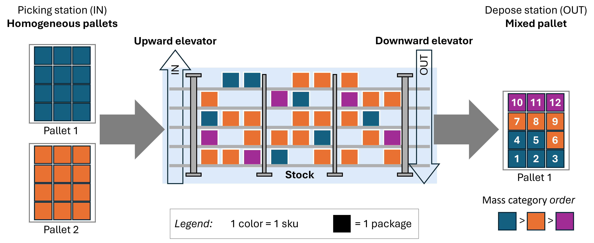
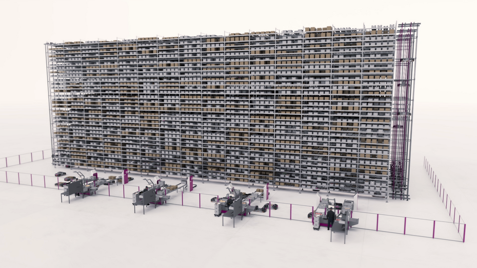
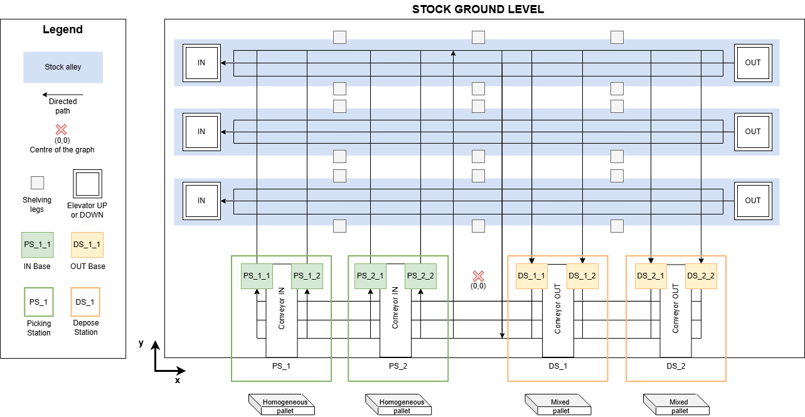
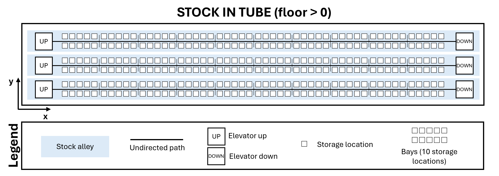

The **DYNALOG** project is part of the field of intralogistics and warehouse automation, where mobile robots meet companies’ needs for flexibility and performance. Specifically, the project focuses on evaluating FIVES XCELLA’s solution, in which order fulfillment is handled by a fleet of AGVs capable of navigating and accessing warehouse racks via a system of elevators to retrieve or deposit packages. 
A package is a container arising from a homogeneous pallet with one type of items, all the packages of one pallet have the same reference (SKU).

 

This solution highlights the importance of inventory management, as well as mission scheduling and the selection of AGV paths.

 

# Warehouse Description
The warehouses in the FIVES XCELLA solution organize product inventory into alleys with levels featuring elevators for ascending on one side and descending on the other.
Each level in an alley, known as ‘tubes’, is divided in bays separated by shelving legs. Each bay contains a set of storage locations on either side of the tube.

In addition to the storage area, there is a floor space dedicated to pick and deposite packages. Depalletizing robots place packages to be stored onto conveyors so that AGVs can retrieve them at collection points (IN Bases). Similarly, palletizing robots retrieve packages to be removed from inventory onto conveyors, which are fed by packages deposited by the AGVs at deposit points (Bases OUT). We assume that the overall inbound and outbound throughput rates are equal, such that the average number of products in inventory remains constant.

The AGVs can move through the warehouse by traveling on the floor, using elevators  to access upper levels, and traveling in tubes. All movements permitted by the AGVs are modeled as a directed graph. The nodes of the graph represent points of interest on the floor or within the warehouse.

A video is avalaible [here](https://www.youtube.com/watch?v=A7SbZuiYZvM) to show the system.

# Glossary

To ensure clear communication and shared understanding among all stakeholders, this section provides definitions of key terms and parameters used throughout the problem description. 

|      **Key terms**               |                                      **Definition**                                                          | 
| :------------------------------: | :----------------------------------------------------------------------------------------------------------: | 
|  Stock                           | A system of racks organized into alleys, levels, and bays (each alley has N bays) for storing packages     |
|  Tubes                           | Horizontal levels of the storage racks, which serve as the AGV traffic lanes on each floor                 | 
|  Bays                            | Furniture organizing the alleys: grouping storage locations. Each bay has 5 positions (nodes), each corresponding to 2 storage locations accessible from the tube path (1 on the left, 1 on the right)                                                                         |
|  Location                        | A storage location capable of holding one package, accessible from a position within a tube (node), to the right or left |
|  Product reference (SKU)         | A unique item reference used to identify the contents of a package. A package can contain only one reference, but multiple stock locations may have the same reference (redundancy)                                                                                              |
|  Package                         | Individual container stored in locations                                                                   |
|  Upward elevator (IN)            | An elevator at the entrance to the alley that allows AGVs to travel up to the tubes                        |
|  Downward elevator (OUT)         | An elevator at the end of the alley that allows AGVs to return to ground floor                             |
|  IN Base                         | Collection point where AGVs pick up packages to be put into stock                                          |
|  OUT Base                        | Drop-off point where AGVs deposit packages to be removed from inventory                                    |
|  Picking Stations (IN)           | All IN Bases and infeed conveyors associated with a depalletizing robot                                    |
|  Depose Stations (OUT)          | All OUT Bases and exit conveyors associated with a palletizing robot                                       |
|  Homogeneous pallet              | Pallet consisting of packages containing same SKU                                                          |
|  Mixed Pallet                    | Pallet consisting of packages containing different SKU                                                     |
|  Depalletizing Robot             | Depalletizes homogeneous pallets and places the packages onto one or more conveyors feeding the IN Base    |
|  Palletizing Robot               | Prepares mixed pallets from packages coming from one or more conveyors fed by the OUT Base                 |
|  AGV                             | Autonomous mobile robot responsible for transporting packages within the warehouse                         |

# Modeling
Each edge of the graph represents a path that an AGV can take to move through the warehouse. An edge can be:
-   directed (traveled in only one direction), if it is on the warehouse ground floor;
-   undirected (traveled in both directions), if it is in the tubes (storage levels)

And each node in the graph represents either a path intersection or a point of interest where an AGV can perform an ACTION.
An ACTION can be:
-    Picking up a package: either from an IN Base or from a location in a tube
-    Dropping off a package: either at an OUT Base or at a location in a tube
-    Attaching to an elevator
-    Detach from an elevator
-    Board an elevator to go up to a tube level in the warehouse
-    Board an elevator to go down to the ground floor
-    Move between two nodes in the graph
-    Change direction
-    Wait at a graph node

We distinguish between the warehouse ground level and the storage floor levels; in fact, each floor has only one path per alley (*i.e* tube), which simplifies the planning stage.

Next is a diagram of the different levels and components for a simple warehouse with:
-    10 alleys and 10 levels (10 tubes per alley) beneath the storage area;
-    1 depalletizing robot (picking station) with 4 IN Bases;
-    2 palletizing robots (depose stations) with 2 OUT Bases each;
-    10 bays per alley, each with 5 positions (nodes), giving an access to 5 locations on the right and 5 on the left.	

The following figure is a schematic representation of the warehouse - View of floor-level components. **to be modified**

The next figure is a schematic representation of the storage locations in each tube for each alley. **to be modified**

# System Constraints
In addition to the structural data provided above, the system imposes the following constraints:
-   One AGV per elevator at a time;
-   Only one AGV per bay, with a maximum of three AGVs per tube;
-   A package can contain only one SKU, but multiple stock locations may have the same SKU (redundancy);
-   The order in which packages are sent to the palletizing conveyors (OUT) must be followed;
-   A maximum of one AGV per graph node and a minimum distance of 10 cm between AGVs at all times (applies whether AGVs are following one another or crossing paths on two parallel paths)

# Inventory and SKUs
To model realistic inventory, we consider two pieces of information about SKUs:
- The presence of an SKU in inventory and in orders follows a “popularity” or skewness pattern. In other words, not every product has the same probability of being ordered; some products are more popular (in demand) and are therefore stocked in greater quantities.
- Each SKU has weight/volume data that allows them to be sorted into three categories: M1 for the heaviest, M2 for medium, and M3 for the lightest. This category is used to organize outgoing pallets: packages containing SKUs in category M1 are placed first on the pallet, followed by M2, and then M3.
The popularity distribution of SKUs follows an exponential distribution, as shown in the image below:

When a test scenario is generated, the number of distinct SKUs is provided, along with the parameter q of an q_exponential distribution, which is used to set the slope of the popularity curve. Each SKU is then assigned a popularity value as shown in the image above.
We also consider the case where all SKUs have the same popularity—a value of 1, for example—following a uniform distribution.
Next, each SKU is also assigned a weight/volume class—M1, M2, or M3—with equal probability. Thus, each SKU has popularity and weight information, which are subsequently used to consistently generate the output pallets, followed by the initial inventory and the input pallets.

The initial inventory is represented by a list of SKUs, without specific locations within the inventory. When a scenario is run by the framework, these locations are initialized by calling the “scheduler.” This ensures that the initial inventory layout is consistent with the scheduling algorithm used in the scenario.
The inventory is therefore represented as a dictionary, associating each SKU with one or more storage locations. A storage location is an object defined.

# Mission
FIVES XCELLA uses input scenarios that model two types of missions:
- IN mission: involves storing an item in inventory after it arrives at an IN Base.
- OUT mission: involves removing an item from inventory in response to an order and placing it on one of the OUT Bases to assemble a pallet. The packages containing the items are placed on the OUT Bases according to a strict priority order (rank) for filling the pallet.

The rank helps balance the pallet and the products; heavier items on the bottom, lighter items on top.
These two types of missions should be performed consecutively whenever possible: IN followed by OUT, provided that the package for the IN mission is placed in the same tube as the package to be picked for the OUT mission.

The steps in an IN mission are as follows:
-    A homogeneous pallet is placed on the picking station (PS) of a depalletizing robot. The robot removes the packages and places them on one or more conveyors feeding the IN Bases;
-    An AGV positions itself at an IN Base to retrieve a package to be stored;
-    The AGV transports the package to its destination: it travels from the IN Base to the corresponding elevator, then ascends to the floor where the assigned storage location is located;
-    The AGV enters the tube to reach the storage location;
-    Once it arrives at the node, it places the package in the designated location (left or right);
-    The IN mission is then complete. The AGV may or may not immediately receive a new mission and then go back to the picking and deposit area.

The steps of an OUT mission are as follows:
-    The AGV travels to the location of the package to be picked from the warehouse. To do this, it takes the corresponding elevator (if necessary), then goes up to the floor where the assigned location is;
-    The AGV retrieves the target package;
-    Once loaded, the AGV proceeds to the descending elevator to return to the assigned OUT Base;
-    The AGV unloads the package onto one of the OUT Bases associated with the DS, following a priority order (rank) for filling the pallet.
-    The package is retrieved by the palletizing robot from the conveyor and placed onto the corresponding pallet;
-    The OUT mission is then complete. The AGV can immediately receive a new mission (IN or OUT).

## Fixed parameters for the missions under consideration
-    Outbound pallets are uniformly sized at 50 packages
-    Inbound pallets may be partially depalletized
-    The priority order of packages on OUT missions is a parameter called “rank”. The rank takes a value from 0 (bottom) to 49 (top), the rank is reset to 0 for each new pallet.
-    Upon arrival at the picking stations (PS), each package to be stored is assigned to an IN Base and will be available during the IN mission.
-    Upon departure from the depose stations (DS), OUT Bases are not differentiated for package assignment. OUT missions provide the DS information, and the AGVs deposit the packages at the first available OUT Base, following the order determined by the package’s position on the pallet. The OUT palletizing robots are capable of rearranging the order of two consecutive packages (maximum position error of 1).

# Input: Test Scenarios - Inventory and Missions
In order to test and compare the project’s various algorithms, it is necessary to formalize test datasets in the form of representative scenarios. These scenarios reflect two aspects in particular: the representation of a realistic warehouse inventory and the management of missions to be performed by AGVs in the form of coherent missions. These dataset will be given to the contestants.

The list of IN/OUT missions over a 2-hour period will be given, in JSON format, including the following information:
-    IN missions: SKU, storage location, PS where to pick up the package
-    OUT missions: SKU, storage locations (all locations where the requested SKU is located), DS where to drop off the package, rank, date by which the pallet must be complete

A FlexSim model of the given structure with a dashboard will allow participants to test their solutions directly in the evaluation tool.

# Decision and KPI
The model developed by the participating teams must make the following decisions:
-    Where to store (IN)?
-    Where to retrieve (OUT)?
-    Which AGV for which mission?
-    In what order should the missions be executed?

Specific KPIs will be defined soon. Currently, some relevant KPIs are : delay and computation time.

# Output
Develop a management strategy using a combination of algorithms to achieve an optimal solution with the best possible performance metrics.

Expected deliverables are the following:
-    A list of scheduled missions with their allocations (to be sent to FlexSim)
-    A list of storage locations of SKUs over time
-    A report explaining the implemented logic and justifying the choice of algorithms (respecting SOHOMA template)
