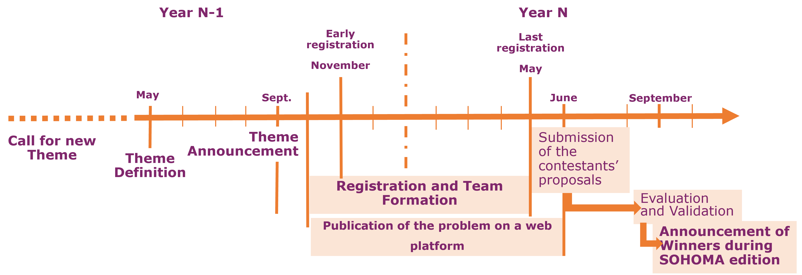

# Benchmark 9. Intelligent Manufacturing International Contest: IMIC

## Motivations & Ambitions
The smart manufacturing community lacks of a suitable, comprehensive, and standardized benchmark for real industrial cases in manufacturing.
This type of tools is however highly needed to compare quantitatively academics proposals based on representative case studies of industrial systems and identify areas of improvement.
Given the time and effort required to build such a benchmark, the fundamental approach at the heart of the IMIC is to foster progressive collaboration among the scientific community over time.
To do so, the IMIC aims, each year, to propose a manufacturing problem submitted to the community in a form of a student/researcher academic competition. 
Results of the contest will then be considered as candidate solutions of the proposed problem, and will be compared and archived as a new benchmark instance.
In a couple of years, IMIC is expected to become a reference benchmark for the community.

## Second edition's theme: The Flexibac problem + (PLUS)

  

The theme was announced during the SOHOMA 2025 conference. The Flexibac+ problem is an evolution of the first problem proposed for the first IMIC edition. In 2025, the different proposals oly adressed 2.5% of the total number of instances. Moreover over, only online solutions were proposed.

  

Flexibac+ takes up last year's theme with a view to pushing for the resolution of all available instances.

More details on the problem are available [here](2026_edition/The_Flexibac_Problem.md).

## Important dates
People interested in joining the contest should consider the following planning

### *From September to May* : Registration and team formation
Registration is opened from September to May.
Early registrations are opened until the 15th of November 2025.
Late registration : May.
Contest results will be due by the end of June 2026.

Teams should registered to the contest via an online form available [here](https://forms.office.com/e/R06t6rwXTC).
There are no limitations in the number of members in team, that could be constituted of students, industrials or academics.
The registration is completely free.

### *From October to May* : Development of solutions, interactions via mail or the web platform
This Github page is the container of all information related to IMIC.
The following pages are available for team members to access and use :
+ The problem is detailed [here](2026_edition/The_Flexibac_Problem.md).
+ A simulator is provided to the teams for testing their tentative solutions. All information about the simulator and its use are available [here](2026_edition/Simulator/README.md).
+ A FAQ is available [here](FAQ.md).
+ A forum will be opened if needed.
The IMIC organization team will make its best to keep the participants informed of any important context modifications, but team members are advised to come on these pages regurlarly to check for any changes.

### *End of June* : Submission of the contestants' proposals
The different proposal have to be submitted before **June, 30, 2026**. The organizing team will not consider proposals coming after this deadline.
The submission should include :
+ A short paper describing the methodology followed to obtain the solution.
+ The input files needed to check the solution via the simulator (for more information, see the problem page).

### *From July to September* : Evaluation and validation of the contestants' proposals 
The different proposals will be evaluated on different criteria related to the quality of the solution but also The quality, rigor, and care taken in the publication.

## Contest prizes
To be announced.

## References
[Presentation of IMIC at the SOHOMA 2024 workshop](https://hal.science/hal-04770839)
